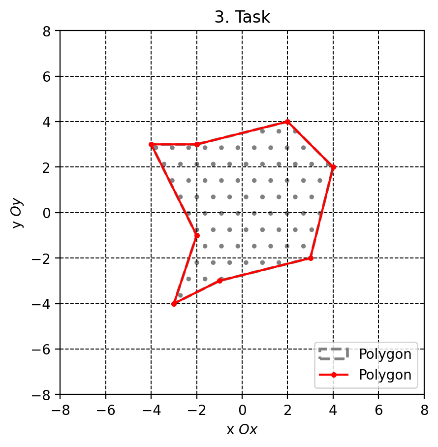
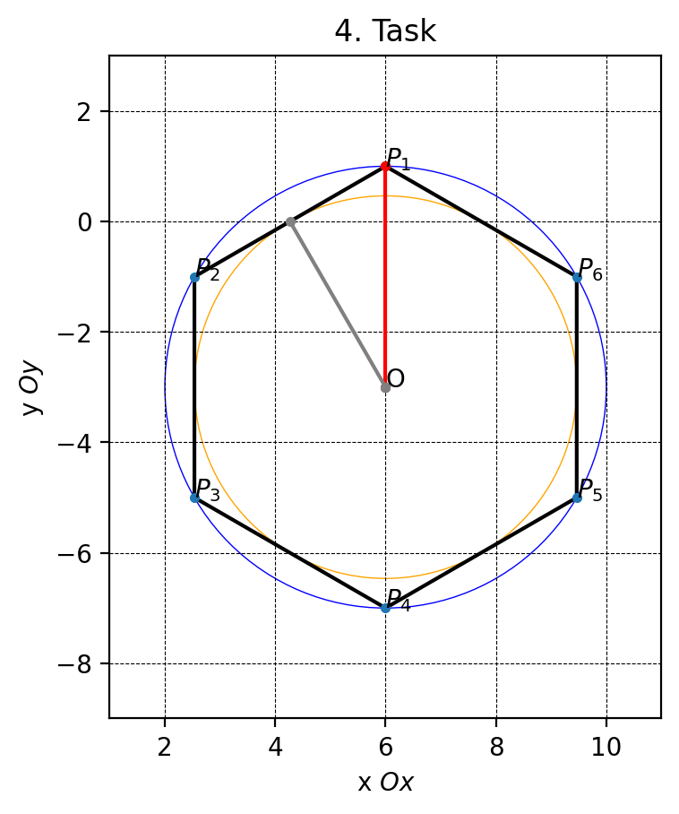
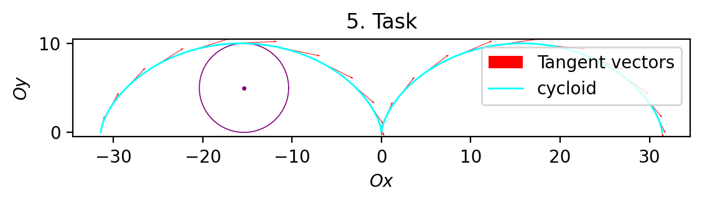
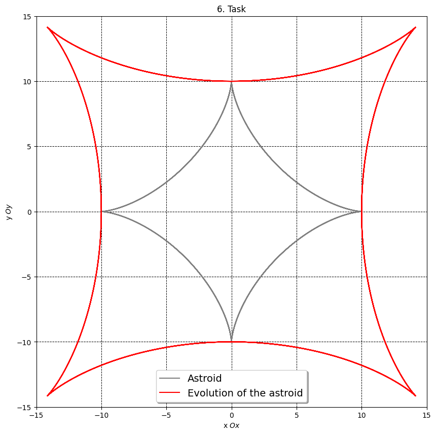
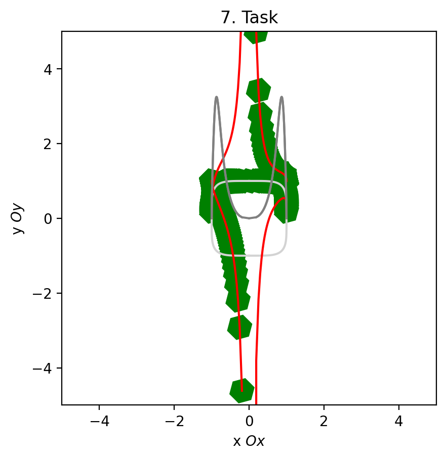
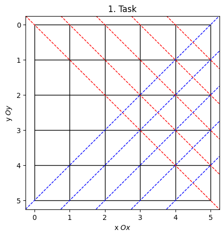
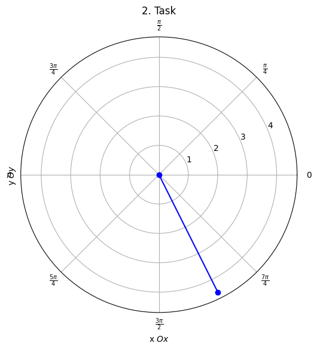

# Лабораторная работа №1
## по предмету Компьютерная геометрия и геометрическое моделирование
- Студент Ф.И.О: **Мерич Дорук Каймакджыоглу**.
- Студ Ноиер: **1032204917**.
- Группа: **НКНбд-01-20**.
<br>
order of tasks
3->4->5->6->7->1->2


```python
%matplotlib inline
import matplotlib.pyplot as plt
import numpy as np

import matplotlib.patches as mpatches
import matplotlib.lines as mlines
```


```python
XY = [(-2, 3), (2, 4), (4, 2), (3, -2), (-1, -3), (-3, -4), (-2, -1), (-4, 3), (-2,3)]
# coordinates in tuple.
# converting the coordinates to a np array.
a = np.array(XY)
a
```


    array([[-2,  3],
           [ 2,  4],
           [ 4,  2],
           [ 3, -2],
           [-1, -3],
           [-3, -4],
           [-2, -1],
           [-4,  3],
           [-2,  3]])


```python
# all of x coordinates:
print(a[:, 0])
# all of y coordinates:
print(a[:, 1])
```

    [-2  2  4  3 -1 -3 -2 -4 -2]
    [ 3  4  2 -2 -3 -4 -1  3  3]
    


```python
fig01 = plt.figure(num = 1, dpi = 200) # creating the canvas.
ax01 = fig01.add_subplot(1, 1, 1) # we construct coordinate planes 1, 1.
ax01.grid(color='black', linestyle='dashed', linewidth=0.7) # setting the grid, its color and line type, thickness.
# Setting boundaries:
ax01.set_xlim(left=-8, right=8)
ax01.set_ylim(bottom=-8, top=8)
ax01.set_aspect('equal') # aspect ratio (so as not to stretch the graph).
legend_01='Polygon'
# draw a polyline:
polygon = mpatches.Polygon(a, color='grey', linestyle='--', linewidth=2, label=legend_01, hatch='.', closed=True, fill=False)  
ax01.add_patch(polygon)
ax01.plot((a[:, 0]), (a[:, 1]),color='red', marker='.', label=legend_01)
ax01.set_title('3. Task')
ax01.set_xlabel(r'x $Ox$') # using latex to write formulas).
ax01.set_ylabel(r'y $Oy$')
ax01.legend(loc='lower right', fontsize=10) # # to display the signature location, font.
```


    <matplotlib.legend.Legend at 0x212776e6410>


    

    


```python
xy=(6, -3)   # Center of the polygon.
R=4
n=6

fig02 = plt.figure(num=2,dpi=200)
ax02 = fig02.add_subplot(1, 1, 1)
ax02.grid(color='black', linestyle='dashed', linewidth=0.4)
# Setting boundaries:
ax02.set_xlim(left=xy[0]-R-1, right=xy[0]+R+1)
ax02.set_ylim(bottom=xy[1]-R-2, top=xy[1]+R+2)

ax02.plot(xy[0], xy[1],color='darkcyan', marker='.') # drawing the point.
ax02.annotate('O', xy) # added a caption to the center of the polygon.
ax02.set_aspect('equal') # aspect ratio.

# Calculate the radius of the inscribed circle.
r = R*np.cos(np.pi/n)
# Draw inscribed and circumscribed circles.
circle = mpatches.Circle(xy, radius = R, color='blue', linewidth=0.5, fill=False)
ax02.add_patch(circle) 
circle = mpatches.Circle(xy, radius = r, color='orange', linewidth=0.5, linestyle='-', fill=False)
ax02.add_patch(circle)
# Calculating the vertices of the polygon.
coords = [((xy[0]+R*np.cos(np.pi/2+2*i*np.pi/n)), (xy[1]+R*np.sin(np.pi/2+2*i*np.pi/n))) for i in range(0, n)]
# Draw the polygon:
polygon = mpatches.Polygon(coords, color='black', linestyle='-', linewidth=1.5, closed=True, fill=False)  # draw a polyline.
ax02.add_patch(polygon)

# Marking the points:
xs = [p for (p, _) in coords]
ys = [p for (_, p) in coords]
ax02.plot(xs, ys, marker='o', markersize=3, linestyle='None')
# Sign the dots:
for i in range(0, n, 1):
    x, y = coords[i]
    ax02.annotate(f'$P_{i+1}$', xy=(xy[0]+R*np.cos(np.pi/2+2*i*np.pi/n), xy[1]+R*np.sin(np.pi/2+2*i*np.pi/n)))

ax02.set_title('4. Task')
ax02.set_xlabel(r'x $Ox$')
ax02.set_ylabel(r'y $Oy$')

# Code for constructing the radius of a circumscribed circle:
# its needed to connect the center of the polygon to any vertex with the center of the polygon which is - x, y as any vertex that 
# lies in coords (first one with the index of 0).
excircle_radius_line = np.array([xy, coords[0]])
ax02.plot(excircle_radius_line[:, 0], excircle_radius_line[:, 1], marker='.', markersize=6, linestyle='-', color='red')

# Code for constructing the radius of an inscribed circle:
# connecting the center of the polygon with the middle of any side (because that's where the circle touches) with the center of the polygon x y as
# The coordinates of the middle of any side are the arithmetic mean of the coordinates of its vertices (side between the first and second).
side_coord_x = (coords[1][0] + coords[0][0]) / 2 # x
side_coord_y = (coords[1][1] + coords[0][1]) / 2 # y
side_coord = [side_coord_x, side_coord_y] # x, y
incircle_radiul_line = np.array([xy, side_coord])
ax02.plot(incircle_radiul_line[:, 0], incircle_radiul_line[:, 1], marker='.', markersize=6, linestyle='-', color='grey');
```


    

    


𝑥(𝑡) = 𝑟(𝑡 − sin 𝑡),

𝑦(𝑡) = 𝑟(1 − cos 𝑡).


```python
# Entering the initial data:
r=5
t = np.linspace(-2*np.pi, 2*np.pi, 100)
# initialize the function:
x = r*(t-np.sin(t))
y = r*(1-np.cos(t))
# take the derevative:
dx = r-r*np.cos(t)
dy = r*np.sin(t)

fig03 = plt.figure(num=3, dpi=200)
ax03 = fig03.add_subplot(1, 1, 1)

# Rendering the circle:
l = np.linspace(0, 2 * np.pi, 100)
X_circle = [(r * np.cos(i) + x[25]) for i in l]
Y_circle = [(r * np.sin(i) + r) for i in l]
ax03.plot(X_circle, Y_circle, marker="", color="purple", linewidth=0.6)
ax03.plot(x[25], r, marker=".", ms=3, color="purple")\

# Rendering the tangent field and the cycloid: (with quiver!!!)
ax03.quiver(x[::4], y[::4], dx[::4], dy[::4], units='xy', angles='xy', width=0.07, scale=2.0, label='Tangent vectors', color='red')
ax03.plot(x, y, linewidth=1, color='cyan', label=r'cycloid')

ax03.set_title('5. Task')
ax03.set_xlabel(r'$Ox$')
ax03.set_ylabel(r'$Oy$')
ax03.legend(loc=1)
ax03.set_aspect('equal')
```


    

    


Нарисовать астроиду и ее эволюту.


```python
# Entering the initial data:
R = 10
t = np.linspace(-R * 1.5, R * 1.5, 100000)
# initialize the function:
x = R * np.cos(t)**3
y = R * np.sin(t)**3
# take the first derevative:
xx = -3 * R * np.sin(t) * np.cos(t)**2
yy = 3 * R * np.cos(t) * np.sin(t)**2
# take the second derevative:
xxx = -3 * R * np.cos(t) * (np.power(np.cos(t), 2) - 2 * np.power(np.sin(t), 2))
yyy = 3 * R * np.sin(t) * (2 * np.power(np.cos(t), 2) - np.power(np.sin(t), 2))
# The evolution of the astroid:
xe = x - yy * (xx**2 + yy**2) / (xx*yyy - xxx*yy)
ye = y + xx * (xx**2 + yy**2) / (xx*yyy - xxx*yy)
# Creating the canvas:
fig04 = plt.figure(figsize=(10,10))
ax04 = fig04.add_subplot(111)
ax04.grid(color='black', linestyle='dashed', linewidth=0.7)
ax04.set_aspect('equal')
# Setting boundaries:
ax04.set_xlim(-R * 1.5, R * 1.5)
ax04.set_ylim(-R * 1.5, R * 1.5)
# labels:
ax04.set_title('6. Task')
ax04.set_xlabel(r'x $Ox$')
ax04.set_ylabel(r'y $Oy$')
# Astroid and its evolution:
ax04.plot(x, y, color='grey', label='Astroid')
ax04.plot(xe, ye, color='red', label='Evolution of the astroid')

ax04.legend(fontsize=14, shadow=True) # Displaying signatures
```


    <matplotlib.legend.Legend at 0x2548b697fd0>


    

    


суперэллипс или кривая Ламе


```python
fig06 = plt.figure(num=6,dpi=200)
ax06 = fig06.add_subplot(1,1,1)

# Setting boundaries:
ax06.set_xlim(left=-5, right=5)
ax06.set_ylim(bottom=-5, top=5)
ax06.set_aspect('equal')
t = np.linspace(0, np.pi/2, 100)

# initialize the functions:
n=5; # from the lab work!
a=1;
b=1
x = a*(np.cos(t))**(2/n)
y = b*(np.sin(t))**(2/n)
xm = -a*(np.cos(t))**(2/n)
ym = -b*(np.sin(t))**(2/n)
# superellips: 
ax06.plot(x,y, color = 'lightgrey')
ax06.plot(x,ym, color = 'lightgrey')
ax06.plot(xm,y, color = 'lightgrey')
ax06.plot(xm,ym, color = 'lightgrey')
# taking first derivatives:
dx = -a*2/n*np.sin(t)*np.cos(t)**(2/n - 1)
dxm = a*2/n*np.sin(t)*np.cos(t)**(2/n - 1)
dy = b*2/n*np.cos(t)*np.sin(t)**(2/n - 1)
dym = -b*2/n*np.cos(t)*np.sin(t)**(2/n - 1)
# taking the second derivatives: (curviture)
ddx = 2*a/n*(2/n-1)*np.cos(t)**(2/n - 2)*np.sin(t)**2 - 2*a/n*np.cos(t)**(2/n-1)*np.cos(t)
ddxm = -2*a/n*(2/n-1)*np.cos(t)**(2/n - 2)*np.sin(t)**2 + 2*a/n*np.cos(t)**(2/n-1)*np.cos(t)
ddy = 2*b/n*(2/n-1)*np.sin(t)**(2/n - 2)*np.cos(t)**2 - 2*b/n*np.sin(t)**(2/n-1)*np.sin(t)
ddym = -2*b/n*(2/n-1)*np.sin(t)**(2/n - 2)*np.cos(t)**2 + 2*b/n*np.sin(t)**(2/n-1)*np.sin(t)

ax06.plot(x, dx + y, color='red')
ax06.plot(xm, dxm + y, color='red')
ax06.plot(y, dy + y, color='red')
ax06.plot(ym, dym + y, color='red')

K1 = abs(dx*ddy-dy*ddx)/(dx**2 + dy**2)**1.5
K2 = abs(dxm*ddym-dym*ddxm)/(dxm**2 + dym**2)**1.5
K3 = abs(dxm*ddy-dy*ddxm)/(dxm**2 + dy**2)**1.5
K4 = abs(dx*ddym-dym*ddx)/(dx**2 + dym**2)**1.5

ax06.plot(x, K1, color='grey')
ax06.plot(xm, K2, color='grey')
ax06.plot(y, K3, color='grey')
ax06.plot(ym, K4, color='grey')

T_x = dx / np.sqrt(dx**2 + dy**2)
T_xm = dxm / np.sqrt(dxm**2 + dym**2)
T_y = dy / np.sqrt(dx**2 + dy**2)
T_ym = dym / np.sqrt(dxm**2 + dym**2)
D_x = 1 / np.sqrt(2)
D_xm = -1 / np.sqrt(2)
D_y = 1 / np.sqrt(2)
D_ym = -1 / np.sqrt(2)
R_x = T_x * D_x - T_y * D_y
R_xm = T_xm * D_xm - T_y * D_y
R_y = T_x * D_x + T_y * D_y
R_ym = T_xm * D_xm + T_y * D_y

ax06.quiver(x, y, R_x, R_y, color='green', scale=2.0, angles='xy',width=0.07, scale_units='xy', pivot='middle')
ax06.quiver(xm, y, R_xm, R_ym, color='green', scale=2.0, angles='xy',width=0.07, scale_units='xy', pivot='middle')
ax06.quiver(y, dy + y, R_x, R_y, color='green', scale=2.0, angles='xy',width=0.07, scale_units='xy', pivot='middle')
ax06.quiver(ym, dym + y, R_xm, R_ym, color='green', scale=2.0, angles='xy',width=0.07, scale_units='xy', pivot='middle')
# at this point im helpless
ax06.set_title('7. Task')
ax06.set_xlabel(r'x $Ox$')
ax06.set_ylabel(r'y $Oy$')
```

    C:\Users\Meric\AppData\Local\Temp\ipykernel_2852\2399502387.py:26: RuntimeWarning: divide by zero encountered in power
      dy = b*2/n*np.cos(t)*np.sin(t)**(2/n - 1)
    C:\Users\Meric\AppData\Local\Temp\ipykernel_2852\2399502387.py:27: RuntimeWarning: divide by zero encountered in power
      dym = -b*2/n*np.cos(t)*np.sin(t)**(2/n - 1)
    C:\Users\Meric\AppData\Local\Temp\ipykernel_2852\2399502387.py:31: RuntimeWarning: divide by zero encountered in power
      ddy = 2*b/n*(2/n-1)*np.sin(t)**(2/n - 2)*np.cos(t)**2 - 2*b/n*np.sin(t)**(2/n-1)*np.sin(t)
    C:\Users\Meric\AppData\Local\Temp\ipykernel_2852\2399502387.py:31: RuntimeWarning: invalid value encountered in multiply
      ddy = 2*b/n*(2/n-1)*np.sin(t)**(2/n - 2)*np.cos(t)**2 - 2*b/n*np.sin(t)**(2/n-1)*np.sin(t)
    C:\Users\Meric\AppData\Local\Temp\ipykernel_2852\2399502387.py:32: RuntimeWarning: divide by zero encountered in power
      ddym = -2*b/n*(2/n-1)*np.sin(t)**(2/n - 2)*np.cos(t)**2 + 2*b/n*np.sin(t)**(2/n-1)*np.sin(t)
    C:\Users\Meric\AppData\Local\Temp\ipykernel_2852\2399502387.py:32: RuntimeWarning: invalid value encountered in multiply
      ddym = -2*b/n*(2/n-1)*np.sin(t)**(2/n - 2)*np.cos(t)**2 + 2*b/n*np.sin(t)**(2/n-1)*np.sin(t)
    C:\Users\Meric\AppData\Local\Temp\ipykernel_2852\2399502387.py:51: RuntimeWarning: invalid value encountered in divide
      T_y = dy / np.sqrt(dx**2 + dy**2)
    C:\Users\Meric\AppData\Local\Temp\ipykernel_2852\2399502387.py:52: RuntimeWarning: invalid value encountered in divide
      T_ym = dym / np.sqrt(dxm**2 + dym**2)
    


    Text(0, 0.5, 'y $Oy$')


    C:\Users\Meric\AppData\Roaming\Python\Python311\site-packages\matplotlib\quiver.py:601: RuntimeWarning: invalid value encountered in subtract
      dxy = xyp - xy
    


    

    


1st task from lab report


```python
n = 5

fig, ax = plt.subplots(figsize=(n, n))
ax.grid(False)

for i in range(n + 1):
    ax.vlines(x=i, ymin=0, ymax=n, color='black', linestyle='-', linewidth=1)
    ax.hlines(y=i, xmin=0, xmax=n, color='black', linestyle='-', linewidth=1)

for i in range(n):
    ax.axline((i, 0), slope=1, color='red', linestyle='--', linewidth=1)  # Главная диагональ
    ax.axline((i, n), slope=-1, color='blue', linestyle='--', linewidth=1)  # Побочная диагональ
ax.set_title('1. Task')
ax.set_xlabel(r'x $Ox$')
ax.set_ylabel(r'y $Oy$')
plt.gca().invert_yaxis()  # Инвертируйте ось y для согласования с координатной плоскостью
plt.show()
```


    

    


2nd task from lab report


```python
v1 = np.array([0, 0])
v2 = np.array([2, -4])

# Calculate the polar coordinates for the vectors
r1 = np.linalg.norm(v1)
theta1 = np.arctan2(v1[1], v1[0])

r2 = np.linalg.norm(v2)
theta2 = np.arctan2(v2[1], v2[0])

# Create a new shape with a polar projection
fig = plt.figure(figsize=(6, 6))
ax = fig.add_subplot(111, projection='polar')

# Draw vectors in the polar coordinate system
ax.plot([theta1, theta2], [r1, r2], 'bo-')

# Adjust the divisions by angle
ax.set_xticks(np.arange(0, 2*np.pi, np.pi/4))
ax.set_xticklabels(['0', r'$\frac{\pi}{4}$', r'$\frac{\pi}{2}$', r'$\frac{3\pi}{4}$', r'$\pi$', r'$\frac{5\pi}{4}$', r'$\frac{3\pi}{2}$', r'$\frac{7\pi}{4}$'])

ax.set_title('2. Task')
ax.set_xlabel(r'x $Ox$')
ax.set_ylabel(r'y $Oy$')
plt.show()
```


    

    


```python

```
