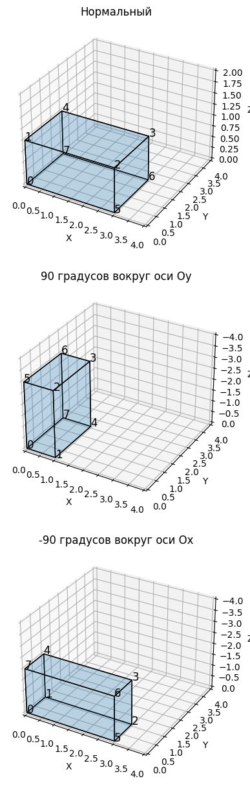
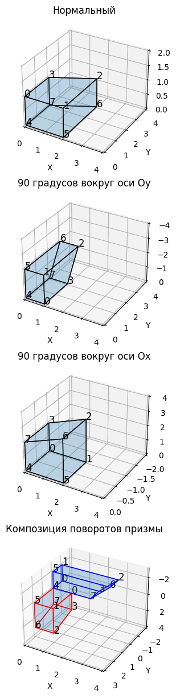
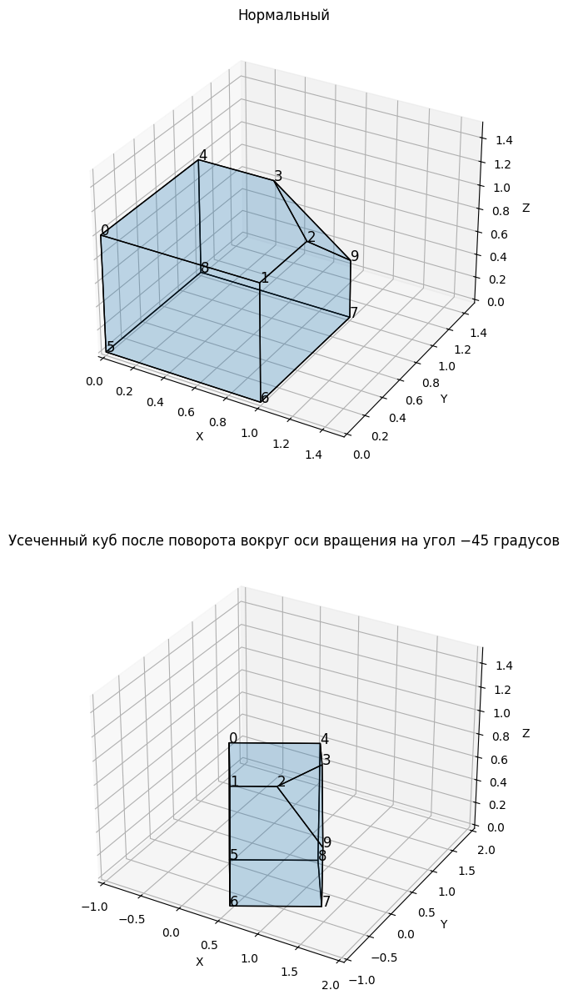
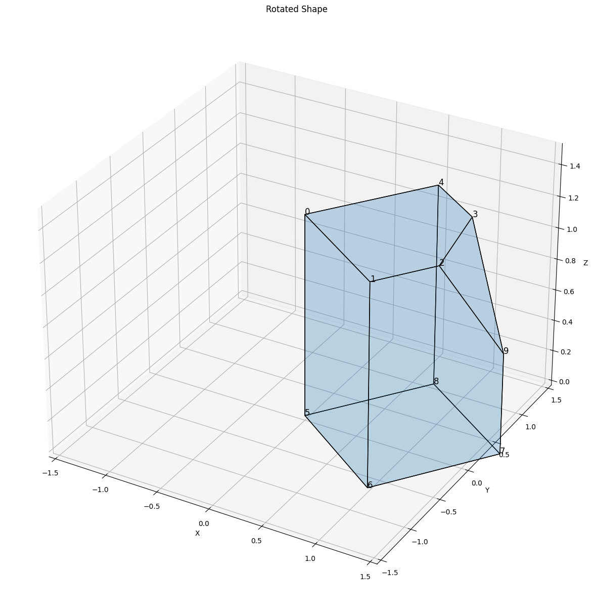

# Лабораторная работа №3
## по предмету Компьютерная геометрия и геометрическое моделирование
- Студент Ф.И.О: **Мерич Дорук Каймакджыоглу**.
- Студ Ноиер: **1032204917**.
- Группа: **НКНбд-01-20**.

***Задание №1***: Следуя примеру 3-4 [1, с. 122] осуществить поворот параллелепипеда на 90 градусов вокруг оси 𝑂𝑦, а затем на −90 градусов вокруг оси 𝑂𝑥. Должны получиться изображения, похожие на рисунки 4. Вычисления сверяйте с примером из книги или с таблицами 2.


```python
import numpy as np
import matplotlib.pyplot as plt
import math
from mpl_toolkits.mplot3d.art3d import Poly3DCollection
```


```python
fig = plt.figure(figsize=(15,15))
ax = fig.add_subplot(311, projection='3d')
ax1 = fig.add_subplot(312, projection='3d')
ax2 = fig.add_subplot(313, projection='3d')

# !!!!! AX !!!!!
coords = np.array([ [0, 0, 0],
                    [0, 0, 1],
                    [3, 0, 1],
                    [3, 2, 1],
                    [0, 2, 1],
                    [3, 0, 0],
                    [3, 2, 0],
                    [0, 2, 0] ])
faces = [[coords[0], coords[1], coords[2], coords[5]],  # Bottom face
        [coords[4], coords[3], coords[6], coords[7]],  # Top face
        [coords[0], coords[1], coords[4], coords[7]],  # Left face
        [coords[2], coords[5], coords[6], coords[3]],  # Right face
        [coords[1], coords[4], coords[3], coords[2]],  # Front face
        [coords[0], coords[7], coords[6], coords[5]]]  # Back face
ax.add_collection3d(Poly3DCollection(faces, edgecolor='black', alpha=0.15))
for i in range(8):
    ax.text(coords[i, 0], coords[i, 1], coords[i, 2], str(i), color='black', fontsize=12)
ax.set_title("Нормальный")
ax.set_xlim([0, 4])
ax.set_ylim([0, 4])
ax.set_zlim([0, 2])
    
ax.set_xlabel('X')
ax.set_ylabel('Y')
ax.set_zlabel('Z')
   
# !!!!! AX1 !!!!!
phi = np.array([[round(math.cos(90)), 0, -math.sin(math.radians(90))],
            [0, 1, 0],
            [math.sin(math.radians(90)), 0, round(math.cos(90))]]) 
coordsy = np.matmul(coords,phi)
facesy = [[coordsy[0], coordsy[1], coordsy[2], coordsy[5]],  # Bottom face
        [coordsy[4], coordsy[3], coordsy[6], coordsy[7]],  # Top face
        [coordsy[0], coordsy[1], coordsy[4], coordsy[7]],  # Left face
        [coordsy[2], coordsy[5], coordsy[6], coordsy[3]],  # Right face
        [coordsy[1], coordsy[4], coordsy[3], coordsy[2]],  # Front face
        [coordsy[0], coordsy[7], coordsy[6], coordsy[5]]]  # Back face
ax1.add_collection3d(Poly3DCollection(facesy, edgecolor='black', alpha=0.15))
for i in range(8):
    ax1.text(coordsy[i, 0], coordsy[i, 1], coordsy[i, 2], str(i), color='black', fontsize=12)
ax1.set_title("90 градусов вокруг оси Oy")
ax1.set_xlim([0, 4])
ax1.set_ylim([0, 4])
ax1.set_zlim([0, -4])
    
ax1.set_xlabel('X')
ax1.set_ylabel('Y')
ax1.set_zlabel('Z')

# !!!!! AX2 !!!!!
psi = np.array([[1, 0, 0],
            [0, round(math.cos(-90)), math.sin(math.radians(-90))],
            [0, -math.sin(math.radians(-90)), round(math.cos(-90))]]) 
coordsx = np.matmul(coords,psi)
facesx = [[coordsx[0], coordsx[1], coordsx[2], coordsx[5]],  # Bottom face
        [coordsx[4], coordsx[3], coordsx[6], coordsx[7]],  # Top face
        [coordsx[0], coordsx[1], coordsx[4], coordsx[7]],  # Left face
        [coordsx[2], coordsx[5], coordsx[6], coordsx[3]],  # Right face
        [coordsx[1], coordsx[4], coordsx[3], coordsx[2]],  # Front face
        [coordsx[0], coordsx[7], coordsx[6], coordsx[5]]]  # Back face
ax2.add_collection3d(Poly3DCollection(facesx, edgecolor='black', alpha=0.15))
for i in range(8):
    ax2.text(coordsx[i, 0], coordsx[i, 1], coordsx[i, 2], str(i), color='black', fontsize=12)
ax2.set_title("-90 градусов вокруг оси Ox")
ax2.set_xlim([0, 4])
ax2.set_ylim([0, 4])
ax2.set_zlim([0, -4])
    
ax2.set_xlabel('X')
ax2.set_ylabel('Y')
ax2.set_zlabel('Z')

    
plt.show()

```


    

    


***Задание №2***: Следуя примеру 3-5 [1, с. 124] осуществить повороты призмы вокруг координатных осей. В результате должны быть получены рисунки, похожие на рис. 5 и рис. 6. Вычисления сверяйте с примером из книги или с таблицами 3.


```python
fig = plt.figure(figsize=(15,15))
ax3 = fig.add_subplot(411, projection='3d')
ax4 = fig.add_subplot(412, projection='3d')
ax5 = fig.add_subplot(413, projection='3d')
ax6 = fig.add_subplot(414, projection='3d')

# !!!!! AX3 !!!!!
coordsa = np.array([[0, 0, 1],
                    [2, 0, 1],
                    [2, 3, 1],
                    [0, 2, 1],
                    [0, 0, 0],
                    [2, 0, 0],
                    [2, 3, 0],
                    [0, 2, 0]])

facesa = [[coordsa[3], coordsa[7], coordsa[6], coordsa[2]],  # Bottom face
        [coordsa[0], coordsa[4], coordsa[5], coordsa[1]],  # Top face
        [coordsa[7], coordsa[4], coordsa[5], coordsa[6]],  # Left face
        [coordsa[3], coordsa[0], coordsa[1], coordsa[2]],  # Right face
        [coordsa[3], coordsa[7], coordsa[4], coordsa[0]],  # Front face
        [coordsa[2], coordsa[6], coordsa[5], coordsa[1]]]  # Back face
ax3.add_collection3d(Poly3DCollection(facesa, edgecolor='black', alpha=0.15))
for i in range(8):
    ax3.text(coordsa[i, 0], coordsa[i, 1], coordsa[i, 2], str(i), color='black', fontsize=12)
ax3.set_title("Нормальный")
ax3.set_xlim([0, 4])
ax3.set_ylim([0, 4])
ax3.set_zlim([0, 2])
    
ax3.set_xlabel('X')
ax3.set_ylabel('Y')
ax3.set_zlabel('Z')

# !!!!! AX4 !!!!!
phi1 = np.array([[round(math.cos(90)), 0, -math.sin(math.radians(90))],
            [0, 1, 0],
            [math.sin(math.radians(90)), 0, round(math.cos(90))]]) 
coordsb = np.matmul(coordsa,phi1)
facesb = [[coordsb[3], coordsb[7], coordsb[6], coordsb[2]],  # Bottom face
        [coordsb[0], coordsb[4], coordsb[5], coordsb[1]],  # Top face
        [coordsb[7], coordsb[4], coordsb[5], coordsb[6]],  # Left face
        [coordsb[3], coordsb[0], coordsb[1], coordsb[2]],  # Right face
        [coordsb[3], coordsb[7], coordsb[4], coordsb[0]],  # Front face
        [coordsb[2], coordsb[6], coordsb[5], coordsb[1]]]  # Back face
ax4.add_collection3d(Poly3DCollection(facesb, edgecolor='black', alpha=0.15))
for i in range(8):
    ax4.text(coordsb[i, 0], coordsb[i, 1], coordsb[i, 2], str(i), color='black', fontsize=12)
ax4.set_title("90 градусов вокруг оси Oy")
ax4.set_xlim([0, 4])
ax4.set_ylim([0, 4])
ax4.set_zlim([0, -4])
    
ax4.set_xlabel('X')
ax4.set_ylabel('Y')
ax4.set_zlabel('Z')

# !!!!! AX5 !!!!!
psi1 = np.array([[1, 0, 0],
            [0, round(math.cos(90)), math.sin(math.radians(90))],
            [0, -math.sin(math.radians(90)), round(math.cos(90))]]) 
coordsc = np.matmul(coordsa,psi1)
facesc = [[coordsc[3], coordsc[7], coordsc[6], coordsc[2]],  # Bottom face
        [coordsc[0], coordsc[4], coordsc[5], coordsc[1]],  # Top face
        [coordsc[7], coordsc[4], coordsc[5], coordsc[6]],  # Left face
        [coordsc[3], coordsc[0], coordsc[1], coordsc[2]],  # Right face
        [coordsc[3], coordsc[7], coordsc[4], coordsc[0]],  # Front face
        [coordsc[2], coordsc[6], coordsc[5], coordsc[1]]]  # Back face
ax5.add_collection3d(Poly3DCollection(facesc, edgecolor='black', alpha=0.15))
for i in range(8):
    ax5.text(coordsc[i, 0], coordsc[i, 1], coordsc[i, 2], str(i), color='black', fontsize=12)
ax5.set_title("90 градусов вокруг оси Ox")
ax5.set_xlim([0, 4])
ax5.set_ylim([0, -2])
ax5.set_zlim([0, 4])
    
ax5.set_xlabel('X')
ax5.set_ylabel('Y')
ax5.set_zlabel('Z')

# !!!!! AX6 !!!!!
# two sides x +90 + y +90 || y +90 + x +90
# burayi duzelt!!!!!!!!!!!!!!!!!!!!!!!!!!!!!!!!!!!!!!!!!!!!!!!!!!!!!!!!
xy = np.array([[round(math.cos(90)), 0, -math.sin(math.radians(90))],
            [pow(math.sin(math.radians(90)),2), round(math.cos(90)), round(math.cos(90))*math.sin(math.radians(90))],
            [round(math.cos(90))*math.sin(math.radians(90)), -math.sin(math.radians(90)), round(math.cos(90))**2]]) 
yx = np.array([[round(math.cos(90)), math.sin(math.radians(90))**2, -round(math.cos(90))*math.sin(math.radians(90))],
            [0, round(math.cos(90)), math.sin(math.radians(90))],
            [math.sin(math.radians(90)), -round(math.cos(90))*math.sin(math.radians(90)), pow(round(math.cos(90)),2)]]) 
coordsxy = np.matmul(coordsa,xy)
coordsyx = np.matmul(coordsa,yx)

facesxy = [[coordsxy[3], coordsxy[7], coordsxy[6], coordsxy[2]],  # Bottom face
        [coordsxy[0], coordsxy[4], coordsxy[5], coordsxy[1]],  # Top face
        [coordsxy[7], coordsxy[4], coordsxy[5], coordsxy[6]],  # Left face
        [coordsxy[3], coordsxy[0], coordsxy[1], coordsxy[2]],  # Right face
        [coordsxy[3], coordsxy[7], coordsxy[4], coordsxy[0]],  # Front face
        [coordsxy[2], coordsxy[6], coordsxy[5], coordsxy[1]]]  # Back face
facesyx= [[coordsyx[3], coordsyx[7], coordsyx[6], coordsyx[2]],  # Bottom face
        [coordsyx[0], coordsyx[4], coordsyx[5], coordsyx[1]],  # Top face
        [coordsyx[7], coordsyx[4], coordsyx[5], coordsyx[6]],  # Left face
        [coordsyx[3], coordsyx[0], coordsyx[1], coordsyx[2]],  # Right face
        [coordsyx[3], coordsyx[7], coordsyx[4], coordsyx[0]],  # Front face
        [coordsyx[2], coordsyx[6], coordsyx[5], coordsyx[1]]]  # Back face
ax6.add_collection3d(Poly3DCollection(facesyx, edgecolor='red', alpha=0.15))
ax6.add_collection3d(Poly3DCollection(facesxy, edgecolor='blue', alpha=0.15))
for i in range(8):
    ax6.text(coordsxy[i, 0], coordsxy[i, 1], coordsxy[i, 2], str(i), color='black', fontsize=12)
    ax6.text(coordsyx[i, 0], coordsyx[i, 1], coordsyx[i, 2], str(i), color='black', fontsize=12)
ax6.set_title("Композиция поворотов призмы")
ax6.set_xlim([0, 4])
ax6.set_ylim([3, -2])
ax6.set_zlim([4, -3])
    
ax6.set_xlabel('X')
ax6.set_ylabel('Y')
ax6.set_zlabel('Z')

plt.show()
```


    

    


***Задание №3***:Данное задание основывается на примере 3-10 из [1, с. 137], однако отличается от него. Дан куб, с отсеченной вершиной, координаты вершин приведены в таблице 4. Необходимо повернуть куб на угол −45 градусов вокруг оси вращения, проходящей через вершину номер 5 и через середину грани с вершинами 2, 3 и 9. Для вычислений использовать формулу Родрига (удобнее всего матричную форму) и, отдельно, кватернионы. Должно получиться изображение, похожее на рисунок 7


```python
fig = plt.figure(figsize=(15,15))
ax7 = fig.add_subplot(211, projection='3d')
#ax8 = fig.add_subplot(312, projection='3d')
ax9 = fig.add_subplot(212, projection='3d')

# !!!!! AX7 !!!!!
coords_a = np.array([
    [0, 0, 1],   # A
    [1, 0, 1],   # B
    [1, 0.5, 1], # C
    [0.5, 1, 1], # D
    [0, 1, 1],   # E
    [0, 0, 0],   # F
    [1, 0, 0],   # G
    [1, 1, 0],   # H
    [0, 1, 0],   # I
    [1, 1, 0.5]  # J (fixed the typo)
])

faces_a = [[coords_a[0], coords_a[5], coords_a[6], coords_a[1]],  # Bottom face
        [coords_a[4], coords_a[8], coords_a[7], coords_a[9], coords_a[3]],  # Top face
        [coords_a[1], coords_a[6], coords_a[7], coords_a[9], coords_a[2]],  # Left face (fixed the order)
        [coords_a[2], coords_a[3], coords_a[9]], # center
        [coords_a[0], coords_a[5], coords_a[8], coords_a[4]],  # Right face (fixed the order and coordinates)
        [coords_a[4], coords_a[3], coords_a[2], coords_a[1], coords_a[0]],  # Front face
        [coords_a[8], coords_a[7], coords_a[6], coords_a[5]]]  # Back face

ax7.add_collection3d(Poly3DCollection(faces_a, edgecolor='black', alpha=0.15))
for i in range(10):
    ax7.text(coords_a[i, 0], coords_a[i, 1], coords_a[i, 2], str(i), color='black', fontsize=12)
ax7.set_title("Нормальный")
ax7.set_xlim([0, 1.5])
ax7.set_ylim([0, 1.5])
ax7.set_zlim([0, 1.5])
    
ax7.set_xlabel('X')
ax7.set_ylabel('Y')
ax7.set_zlabel('Z')

# maths
cx, cy, cz = 1, 1, 1
d = math.sqrt(cy**2 + cz**2)
alpha = np.arccos(cz/d) * (np.pi / 180) # 45 deg
beta = np.arcsin(cx) * (np.pi / 180) # 90 deg
T = np.array([
    [1, 0, 0],
    [0, 1, 0],
    [0, 0, 1]
])
Rx = np.array([
    [1, 0, 0],
    [0, np.cos(alpha), np.sin(alpha)],
    [0, -np.sin(alpha), np.cos(alpha)]
])
Ry = np.array([
    [np.cos(-beta), 0, -np.sin(-beta)],
    [0, 1, 0],
    [np.sin(-beta), 0, np.cos(-beta)]
])
M = np.linalg.multi_dot([T, Rx, Ry])
'''coords_on_xy = coords_a.dot(M)
print(coords_on_xy)

faces_b = [[coords_on_xy[0], coords_on_xy[5], coords_on_xy[6], coords_on_xy[1]],  # Bottom face
        [coords_on_xy[4], coords_on_xy[8], coords_on_xy[7], coords_on_xy[9], coords_on_xy[3]],  # Top face
        [coords_on_xy[1], coords_on_xy[6], coords_on_xy[7], coords_on_xy[9], coords_on_xy[2]],  # Left face (fixed the order)
        [coords_on_xy[2], coords_on_xy[3], coords_on_xy[9]], # center
        [coords_on_xy[0], coords_on_xy[5], coords_on_xy[8], coords_on_xy[4]],  # Right face (fixed the order and coordinates)
        [coords_on_xy[4], coords_on_xy[3], coords_on_xy[2], coords_on_xy[1], coords_on_xy[0]],  # Front face
        [coords_on_xy[8], coords_on_xy[7], coords_on_xy[6], coords_on_xy[5]]]  # Back face

ax8.add_collection3d(Poly3DCollection(faces_b, edgecolor='black', alpha=0.15))
for i in range(10):
    ax8.text(coords_on_xy[i, 0], coords_on_xy[i, 1], coords_on_xy[i, 2], str(i), color='black', fontsize=12)
ax8.set_title("Первый шаг")
ax8.set_xlim([0, 1.2])
ax8.set_ylim([0, 1.2])
ax8.set_zlim([0, 2.5])
    
ax8.set_xlabel('X')
ax8.set_ylabel('Y')
ax8.set_zlabel('Z')'''

Rz = np.array([
    [np.cos(-45), np.sin(-45), 0],
    [-np.sin(-45), np.cos(-45), 0],
    [0, 0, 1]
])
Rx_inverse = np.linalg.inv(Rx)
Ry_inverse = np.linalg.inv(Ry)
T_inverse = np.linalg.inv(T)
M_inverse = np.linalg.multi_dot([Ry_inverse, Rx_inverse, T_inverse])
coords_on_xyz = np.linalg.multi_dot([coords_a, M, Rz, M_inverse])
faces_c = [[coords_on_xyz[0], coords_on_xyz[5], coords_on_xyz[6], coords_on_xyz[1]],  # Bottom face
        [coords_on_xyz[4], coords_on_xyz[8], coords_on_xyz[7], coords_on_xyz[9], coords_on_xyz[3]],  # Top face
        [coords_on_xyz[1], coords_on_xyz[6], coords_on_xyz[7], coords_on_xyz[9], coords_on_xyz[2]],  # Left face (fixed the order)
        [coords_on_xyz[2], coords_on_xyz[3], coords_on_xyz[9]], # center
        [coords_on_xyz[0], coords_on_xyz[5], coords_on_xyz[8], coords_on_xyz[4]],  # Right face (fixed the order and coordinates)
        [coords_on_xyz[4], coords_on_xyz[3], coords_on_xyz[2], coords_on_xyz[1], coords_on_xyz[0]],  # Front face
        [coords_on_xyz[8], coords_on_xyz[7], coords_on_xyz[6], coords_on_xyz[5]]]  # Back face

ax9.add_collection3d(Poly3DCollection(faces_c, edgecolor='black', alpha=0.15))
for i in range(10):
    ax9.text(coords_on_xyz[i, 0], coords_on_xyz[i, 1], coords_on_xyz[i, 2], str(i), color='black', fontsize=12)
ax9.set_title("Усеченный куб после поворота вокруг оси вращения на угол −45 градусов")
ax9.set_xlim([-1, 2.0])
ax9.set_ylim([-1, 2.0])
ax9.set_zlim([0, 1.5])
    
ax9.set_xlabel('X')
ax9.set_ylabel('Y')
ax9.set_zlabel('Z')

plt.show()
```


    

    


```python
fig = plt.figure(figsize=(15, 15))
ax10 = fig.add_subplot(111, projection='3d')


axis_of_rotation = np.array([0, 0, 1])

theta = -45 * (np.pi / 180)

R = np.eye(3) + np.sin(theta) * np.array([[0, -axis_of_rotation[2], axis_of_rotation[1]],
                                          [axis_of_rotation[2], 0, -axis_of_rotation[0]],
                                          [-axis_of_rotation[1], axis_of_rotation[0], 0]]
                                         ) + (1 - np.cos(theta)) * np.outer(axis_of_rotation, axis_of_rotation)

rotated_coords = np.dot(coords_a, R.T)

rotated_faces = [[rotated_coords[i] for i in [0, 5, 6, 1]],  # Bottom face
               [rotated_coords[i] for i in [4, 8, 7, 9, 3]],  # Top face
               [rotated_coords[i] for i in [1, 6, 7, 9, 2]],  # Left face
               [rotated_coords[i] for i in [2, 3, 9]],  # Center
               [rotated_coords[i] for i in [0, 5, 8, 4]],  # Right face
               [rotated_coords[i] for i in [4, 3, 2, 1, 0]],  # Front face
               [rotated_coords[i] for i in [8, 7, 6, 5]]]  # Back face
ax10.add_collection3d(Poly3DCollection(rotated_faces, edgecolor='black', alpha=0.15))
for i in range(10):
    ax10.text(rotated_coords[i, 0], rotated_coords[i, 1], rotated_coords[i, 2], str(i), color='black', fontsize=12)
ax10.set_title("Rotated Shape")
ax10.set_xlim([-1.5, 1.5])
ax10.set_ylim([-1.5, 1.5])
ax10.set_zlim([0, 1.5])

ax10.set_xlabel('X')
ax10.set_ylabel('Y')
ax10.set_zlabel('Z')

plt.show()
```


    

    


```python

```
