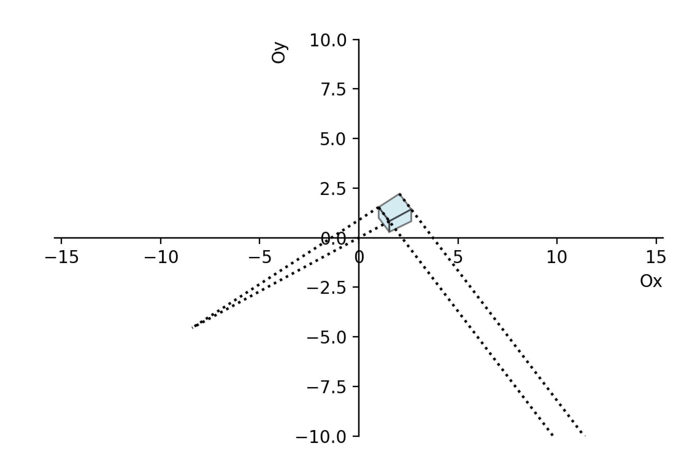
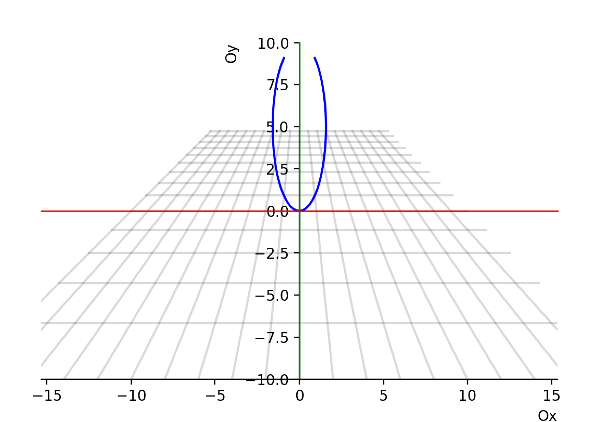

# Лабораторная работа №5,  Компьютерная геометрия и геометрическое моделирование
- Ф.И.О: **Мерич Дорук Каймакджыоглу**.
- Ноиер студ. билета: **1032204917**.
- Группа: **НКНбд-01-20**.

***Задание №1*** 
- Написать программу, которая рисует единичный куб позволяет вращать его вокруг локальных
осей 𝑂𝑥 и 𝑂𝑦, перемещать (транслировать) в любом направлении, а затем проецировать одно-
точечной или двуточечной перспективной проекцией на плоскость 𝑂𝑥𝑦.
- Создать, на выбор, или анимацию, в которой куб будет перемещаться и вращаться отображаясь
при этом в перспективной проекции, или использовать несколько ползунков, которыми можно
будет задавать углы поворотов и смещение по осям для задания трансляции. Изображение с ку-
бом при этом должно перерисовываться.

***Задание №2***
- К предыдущей программе добавьте вычисление точек схода. Изобразите (нарисуйте) прямые, со-
держащие ребра куба и покажите, что они пересекаются в точках схода, как это показано на рисунке 10


```python
import numpy as np
import matplotlib.pyplot as plt
import random

def zad1(x1=1, y1=1, z1=1, alpha=1, beta=-1):
    x=1
    y=1 
    z=1 
    p=0 
    q=0 
    r=-0.1
    vertexes = np.array([
        [0, y, 0, 1], 
        [x, y, 0, 1], 
        [x, 0, 0, 1], 
        [0, 0, 0, 1], 
        [0, y, z, 1], 
        [x, y, z, 1], 
        [x, 0, z, 1], 
        [0, 0, z, 1]]).T
    edges = np.array([
        [0, 1], 
        [1, 2], 
        [2, 3], 
        [3, 0], 
        [0, 4], 
        [1, 5], 
        [2, 6], 
        [3, 7], 
        [4, 5], 
        [5, 6], 
        [6, 7], 
        [7, 4]])
    faces = np.array([
        [3, 2, 1, 0], 
        [4, 5, 6, 7], 
        [0, 1, 5, 4], 
        [1, 2, 6, 5], 
        [2, 3, 7, 6], 
        [3, 0, 4, 7]])
    projection = np.array([
        [1, 0, 0, 0], 
        [0, 1, 0, 0], 
        [0, 0, 1, 0], 
        [p, q, r, 1]])
       
    def progection_matrix():
        projection[0, 0] = np.cos(alpha)
        projection[0, 2] = np.sin(alpha)
        projection[0, 3] = x1
        
        projection[1, 0] = np.sin(alpha)*np.sin(beta)
        projection[1, 1] = np.cos(beta)
        projection[1, 2] = -np.cos(alpha)*np.sin(beta)
        projection[1, 3] = y1
        
        projection[2, 0] = -np.sin(alpha)*np.cos(beta)
        projection[2, 1] = np.sin(beta)
        projection[2, 2] = np.cos(alpha)*np.cos(beta)
        projection[2, 3] = z1

    def points(vertex):
        A = np.array([
            [-vertex[4, 1] + vertex[0, 1], vertex[4, 0] - vertex[0, 0]], 
            [-vertex[5, 1] + vertex[1, 1], vertex[5, 0] - vertex[1, 0]]
        ])
        B = np.array([-vertex[0, 0]*vertex[4, 1] + vertex[0, 1]*vertex[4, 0], -vertex[1, 0]*vertex[5, 1] + vertex[1, 1]*vertex[5, 0]])
        first = None
        if np.linalg.det(A) != 0:
            first = np.linalg.solve(A, B)
        C = np.array([
            [-vertex[1, 1] + vertex[0, 1], vertex[1, 0] - vertex[0, 0]], 
            [-vertex[5, 1] + vertex[4, 1], vertex[5, 0] - vertex[4, 0]]
        ])
        D = np.array([-vertex[0, 0]*vertex[1, 1] + vertex[0, 1]*vertex[1, 0], -vertex[4, 0]*vertex[5, 1] + vertex[4, 1]*vertex[5, 0]])
        second = None
        if np.linalg.det(C) != 0:
            second = np.linalg.solve(C, D)
        return first, second
    
    def translate_shape():
        progection_matrix()
        v = np.array([(vertex/vertex[3])[:2] for vertex in (projection @ vertexes).T])
        for j in range(len(faces)):
            i = faces[j]
            if -v[i[1], 0]*(v[i[0], 1] - v[i[2], 1]) + v[i[1], 1]*(v[i[0], 0] - v[i[2], 0]) - (v[i[0], 0]*v[i[2], 1] - v[i[0], 1]*v[i[2], 0]) >= 0:
                polygon = plt.Polygon(xy=v[i], closed=True, fill=True, color = 'lightblue', ec = 'black', alpha=0.5)
                ax.add_patch(polygon)

        first, second = points(v)
        ax.plot([v[0, 0], first[0]], [v[0, 1], first[1]], linestyle = ':', color = 'black')
        ax.plot([v[1, 0], first[0]], [v[1, 1], first[1]], linestyle = ':', color = 'black')
        ax.plot([v[0, 0], second[0]], [v[0, 1], second[1]], linestyle = ':', color = 'black')
        ax.plot([v[4, 0], second[0]], [v[4, 1], second[1]], linestyle = ':', color = 'black')
        plt.show()

    
    fig = plt.figure(num = 1, dpi = 200)
    ax = fig.add_subplot(1, 1, 1)   
    ax.set_xlabel('Ox', loc = 'right')
    ax.set_ylabel('Oy', loc = 'top')
    for spine in ['left', 'bottom', 'right', 'top']:
        ax.spines[spine].set_position('zero')
    ax.axis('equal')
    ax.set_xlim([-10, 10])
    ax.set_ylim([-10, 10]) 
    translate_shape()

x = random.uniform(-2,2)
y = random.uniform(-2,2)
z = random.uniform(-2,2)
alpha = random.uniform(-6,6)
beta = random.uniform(-6,6)
zad1()
#zad1(x, y, z, alpha, beta)
```



***Задание №3***
- Изобразите (нарисуйте) параболу в перспективной проекции, как это показано на рисунке 11 (см.
следующую страницу). Для создания рисунка использовалась перспективное преобразование с пара-
метрами 𝑝 = 0, 𝑞 = 0.2, 𝑟 = −0.1. Выполнение лабораторной пойдет веселее, если организовать ползу-
нок, который будет регулировать значение параметра 𝑞. Значение параметра 𝑟 также можно регули-
ровать, но он влияет на конечный рисунок не так значительно.


```python
import numpy as np
import matplotlib.pyplot as plt
# Parabola(-9, 9, -10, 10, 0, -0.1)

p = 0
r = -0.1
v_s = np.array([[i, -9, 0, 1] for i in range(-10, 10)]).T
v_e = np.array([[i, 9, 0, 1] for i in range(-10, 10)]).T
h_s = np.array([[10, i, 0, 1] for i in range(-10, 10)]).T
h_e = np.array([[-10, i, 0, 1] for i in range(-10, 10)]).T

parabola = np.array([[x, x**2, 0, 1] for x in np.linspace(-10, 10, 500)]).T

projection = np.array([
    [1, 0, 0, 0], 
    [0, 1, 0, 0], 
    [0, 0, 1, 0], 
    [p, 0, r, 1]
])

fig01 = plt.figure(num = 1, dpi = 200)
ax1 = fig01.add_subplot(1, 1, 1)  
projection[3, 1] = 0.1

try:
    v_grid_start = np.array([(v/v[3])[:2] for v in (projection @ v_s).T])
    v_grid_end = np.array([(v/v[3])[:2] for v in (projection @ v_e).T])
    h_grid_start = np.array([(v/v[3])[:2] for v in (projection @ h_s).T])
    h_grid_end = np.array([(v/v[3])[:2] for v in (projection @ h_e).T])
    v_parab = np.array([(v/v[3])[:2] for v in (projection @ parabola).T])
except (RuntimeError):
    pass

for i, j in zip(v_grid_start, v_grid_end):
    ax1.plot([i[0], j[0]], [i[1], j[1]], color = 'black', alpha=0.15)
for i, j in zip(h_grid_start, h_grid_end):
    ax1.plot([i[0], j[0]], [i[1], j[1]], color = 'black', alpha=0.15)
ax1.plot(v_parab[:, 0], v_parab[:, 1], color = 'blue')
    

ax1.set_xlabel('Ox', loc = 'right')
ax1.set_ylabel('Oy', loc = 'top')
for spine in ['left', 'right', 'top']:
    ax1.spines[spine].set_position('zero')
    ax1.spines[spine].set_linewidth(1)
    ax1.spines[spine].set_color('green')
    
ax1.spines['top'].set_color('red')
ax1.axis('equal')
ax1.set_xlim([-10, 10])
ax1.set_ylim([-10, 10])
plt.show()
```

    C:\Users\Meric\AppData\Local\Temp\ipykernel_4364\3110079049.py:28: RuntimeWarning: divide by zero encountered in divide
      h_grid_start = np.array([(v/v[3])[:2] for v in (projection @ h_s).T])
    C:\Users\Meric\AppData\Local\Temp\ipykernel_4364\3110079049.py:28: RuntimeWarning: invalid value encountered in divide
      h_grid_start = np.array([(v/v[3])[:2] for v in (projection @ h_s).T])
    C:\Users\Meric\AppData\Local\Temp\ipykernel_4364\3110079049.py:29: RuntimeWarning: divide by zero encountered in divide
      h_grid_end = np.array([(v/v[3])[:2] for v in (projection @ h_e).T])
    C:\Users\Meric\AppData\Local\Temp\ipykernel_4364\3110079049.py:29: RuntimeWarning: invalid value encountered in divide
      h_grid_end = np.array([(v/v[3])[:2] for v in (projection @ h_e).T])
    


```python

```


```python

```
